# Gym Hub UK

**Live Site:** https://gymhub-1ec6d4b9abaf.herokuapp.com

## Table of Contents

- [Overview](#overview)
- [Purpose](#purpose)
- [Target Audience](#target-audience)
- [User Stories](#user-stories)
- [UX / UI Rationale](#ux--ui-rationale)
- [Database Design](#database-design)
- [Features](#features)
- [Page Breakdown](#page-breakdown)
- [Accessibility Features](#accessibility-features)
- [Responsive Design](#responsive-design)
- [Technologies Used](#technologies-used)
- [Testing](#testing)
- [Bugs and Fixes](#bugs-and-fixes)
- [Version Control](#version-control)
- [Deployment](#deployment)
- [Future Improvements](#future-improvements)
- [References](#references)

---

## Overview

Gym Hub UK is a full-stack Django web application created to help users find, compare and review gyms across the UK. The main idea behind the project is to bring gym information into one place instead of users having to search across different websites, Google listings or social media pages.

The website allows users to browse gyms, search by location or gym details, filter by price range and amenities, and view individual gym pages with images, reviews and map locations. Registered users can also bookmark gyms, leave reviews and submit new gyms that are not already listed.

To keep the listings more controlled, new gym submissions are not shown publicly straight away. They are set as pending first and can then be approved or rejected through the admin side of the project. This helps make the website feel more realistic as a proper community-based platform rather than just a basic list of gyms.

Key features include:
- searching and filtering gyms
- submitting new gym listings
- admin approval for submitted gyms
- writing, editing and deleting reviews
- bookmarking gyms
- viewing gym locations with Google Maps
- account pages for saved and submitted gyms

## Purpose

The purpose of Gym Hub UK is to give users one place where they can find and compare gyms based on useful information rather than only relying on basic search results. A lot of gym information online can be spread across different sites, and sometimes it does not include enough detail from actual users.

This project aims to make that process easier by allowing users to search for gyms, filter by amenities, read reviews and save gyms they may want to come back to later. Users can also submit gyms that are not already listed, which makes the site more community based instead of only being controlled by one person.

Another purpose of the project is to keep the information controlled through admin moderation. New gyms are set as pending first, so they can be checked before being shown publicly. This helps avoid incorrect or duplicate listings appearing straight away.

From a development point of view, this project was built to show how a Django web application can use structured database models, user accounts, forms, CRUD functionality, third-party APIs and deployment together in one full-stack project.

## Target Audience

Gym Hub UK is aimed at users who want to find gyms more easily and compare them before deciding where to train. The website is mainly built around people who care about location, price, facilities and other users' experiences.

The main target audience includes:

- **Gym users and fitness enthusiasts**  
People who already train or are interested in joining a gym and want to compare different options before choosing one.

- **People moving to a new area**  
Users who may have moved city, started university, changed jobs or are travelling and need to find a gym nearby.

- **Users looking for specific facilities**  
People who need certain amenities such as 24/7 access, power racks, classes, showers, parking or women-only areas.

- **Community contributors**  
Users who want to add gyms that are missing from the site or leave reviews based on their own experience.

- **Admin/staff users**  
Users with permission to review submitted gyms and keep the platform more accurate by approving or rejecting listings.

## User Stories

### General Users

- As a user, I want to search for gyms by name, city or location so I can find gyms that are relevant to me.
- As a user, I want to filter gyms by price range and amenities so I can find gyms with the facilities I need.
- As a user, I want to view a gym detail page so I can see more information before deciding whether to visit.
- As a user, I want to see reviews and ratings so I can get a better idea of other users' experiences.
- As a user, I want to view gym locations on a map so I can understand where the gym is based.
- As a user, I want the website to work on mobile so I can search for gyms easily on different devices.

### Registered Users

- As a registered user, I want to create an account so I can use the interactive features of the website.
- As a registered user, I want to log in and log out so my account is protected.
- As a registered user, I want to bookmark gyms so I can return to them later.
- As a registered user, I want to view my bookmarked gyms so I can manage the gyms I have saved.
- As a registered user, I want to submit a new gym so missing gyms can be added to the platform.
- As a registered user, I want to view my submitted gyms so I can keep track of what I have added.
- As a registered user, I want to leave a review so I can share my own experience of a gym.
- As a registered user, I want to edit or delete my own review so I can manage my content.

### Staff/Admin Users

- As a staff user, I want to approve submitted gyms so only checked listings appear publicly.
- As a staff user, I want to reject invalid gym submissions so the website data stays more accurate.
- As a staff user, I want to manage amenities and gym details through the admin panel so the site can be maintained properly.

## UX / UI Rationale

The UX/UI for Gym Hub UK was based around making the gym browsing process feel simple, visual and easy to follow. I wanted the site to feel more like a modern fitness platform rather than a basic Django CRUD project, so the design uses large gym images, bold headings, card layouts and clear action buttons.

The main focus was to keep the pages easy to scan. Users should be able to quickly search for gyms, compare cards, open a detail page, read reviews and bookmark gyms without having to think too much about where things are. This is why the gym list page keeps the search and filter section near the top, while the gym cards use the same structure throughout the site.

The visual style was also influenced by a personal fitness-related project I had been working on. Instead of copying individual sections directly, I translated the same design approach into this Django project by using CSS variables and reusable classes. This made it much quicker to build because I already had a clear idea of the colour palette, spacing, rounded cards, button style and image-heavy layout I wanted.

For example, I took the idea of design tokens such as background colours, cyan accent colours, border radius, shadows and spacing, then recreated them in the Django CSS file as variables. This meant I could style different pages consistently without having to redesign every component from scratch. Once the card style, buttons and form inputs were set up, they could be reused across the gym list, detail page, account pages and forms.

This also made the project easier to manage because the same reusable assets and styles are called across different pages. For example, the gym card layout is reused in more than one page, and the button/card styles come from the same CSS rules. This means if I change one reusable style, such as the card border radius, button spacing or accent colour, it updates across the whole website instead of needing to edit each page separately.

The dark background was chosen because it fits the gym/fitness theme and also makes the cyan accent colour stand out clearly. The cyan colour was used for important highlights such as links, ratings, selected states and buttons so users could easily notice interactive elements. Large images were used on the home page and gym cards because gym users usually want a quick visual impression of the space before reading more detail.

### Project Planning

I used a simple Gantt chart to plan the main parts of the project across the three week build. This helped me split the work into planning, Django setup, core features, user features, deployment, testing and final README work.

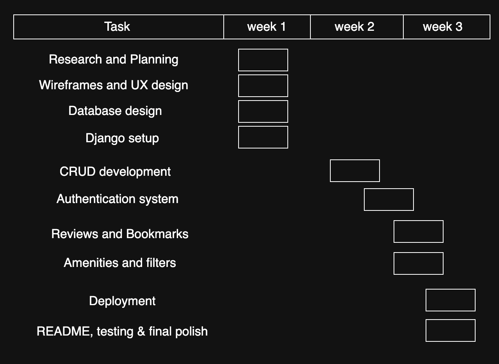

### Wireframes

Before building the main pages, I created simple wireframes to plan the layout and page structure. These were kept basic on purpose so I could focus on where the main content, navigation and buttons would go before adding the final styling.

Home page wireframe:

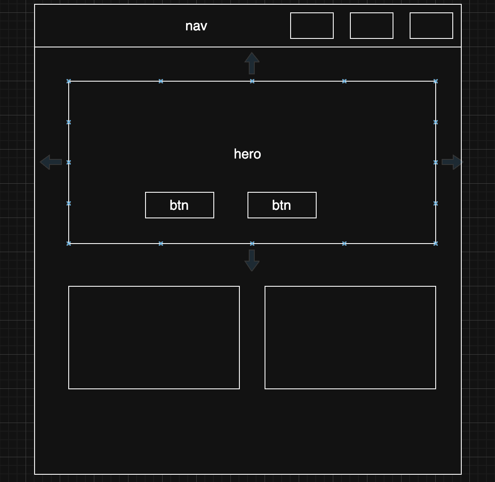

Gym list page wireframe:

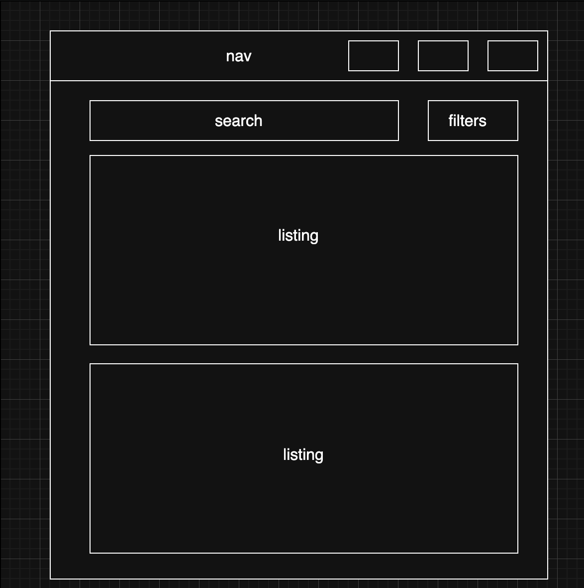

Add gym page wireframe:

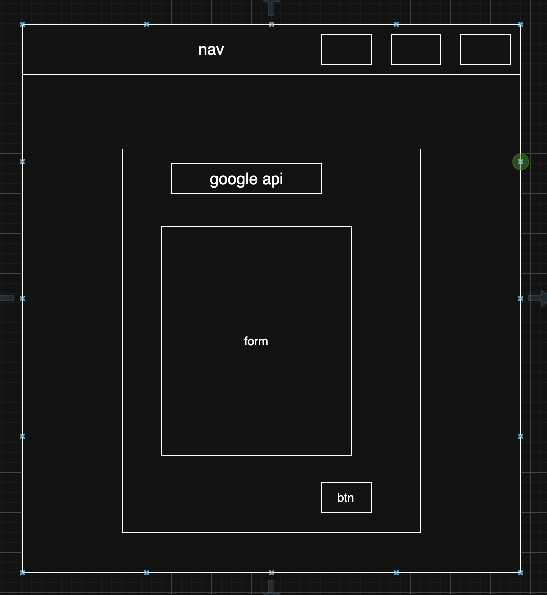

### Design Tokens

Design tokens were used to keep the styling consistent across the website. Instead of choosing colours and spacing separately on each page, I placed the main style values in the CSS file and reused them throughout the project.

The main tokens included:
- dark background colours
- cyan accent colour
- muted text colours
- card background colours
- border colours
- rounded corner values
- spacing values
- button and input styling

This helped speed up the design process because once the main style rules were set, I could apply the same look to new pages quickly. For example, the same button styling is used across the navbar, add gym form, account links and review actions. The same card styling is also reused for gym cards, review cards and account sections.

Using reusable styling also reduced repeated code. Instead of writing a completely new design for every page, I could call the same classes and assets where they were needed. This made the design more consistent and made later changes quicker because one update in the CSS could affect all matching elements.

### Visual Hierarchy

Visual hierarchy was important because the site has a lot of different features, such as search, filters, reviews, bookmarks, amenities and maps. To avoid making the interface feel cluttered, I used large headings, clear spacing and card sections to separate information.

The gym cards are image-led so users can first recognise the gym visually, then read the name, city, rating, amenities and bookmark information. Buttons are also styled with strong contrast so the user can clearly see the main actions, such as adding a gym, searching, bookmarking or submitting a form.

Forms were kept simple with clear labels, large input fields and required markers where needed. This was important on the add gym page because there are several fields, including Google autocomplete, image upload, price range and amenities. Keeping the spacing clear made the form easier to complete.

### Navigation

The navigation was designed to stay simple and not take attention away from the main content. The logo links back to the home page, while the main actions change depending on whether the user is logged in or logged out.

When a user is logged out, the navbar shows options like login and sign up. When a user is logged in, it shows account-related options such as My Account, Log Out and Add Gym. This keeps the navigation relevant to the current user.

On mobile, the navigation changes into a Bootstrap hamburger menu. This was added because the full desktop navigation would take up too much space on smaller screens. The hamburger menu keeps the navbar cleaner and makes the site easier to use on mobile devices.

## Database Design

The database was designed around the main gym listing system. The `Gym` model is the central model because most of the other data connects back to a gym, such as reviews, bookmarks and amenities. I planned it this way because the website is mainly based around users being able to add, save, review and view gyms.

The diagram below shows the main relationships between the models. It is a simplified ER diagram, so it focuses on the core structure rather than showing every extra field used later for Google Maps, images, upload fields and moderation.

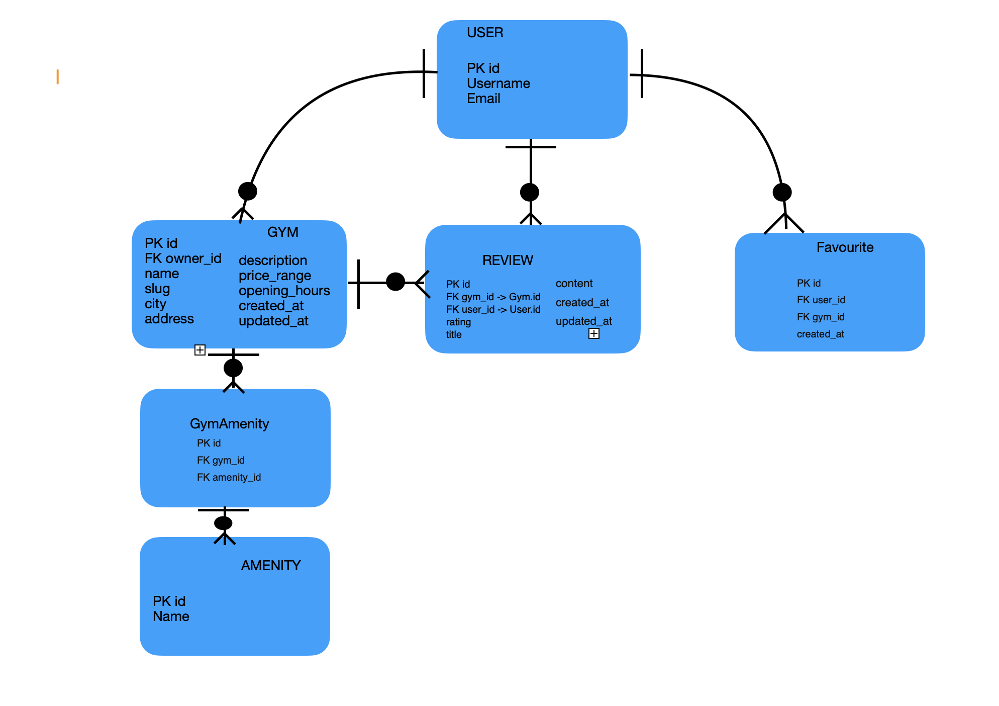

### Model Breakdown

| Model | Purpose | Important Fields | Relationship |
|-------|---------|------------------|--------------|
| `User` | Handles user accounts using Django's built-in user model. | username, email, password | A user can submit gyms, write reviews, bookmark gyms and approve gyms if they are staff/admin. |
| `Gym` | Stores the main gym listing information. | owner, name, slug, city, address, postcode, description, price_range, image, status | A gym belongs to one owner and can have many reviews, bookmarks and amenities. |
| `Review` | Stores user reviews for gyms. | gym, user, rating, comment, created_at | Each review belongs to one gym and one user. |
| `Favourite` | Stores bookmarked gyms. The model name is `Favourite`, but the interface uses the word bookmark. | user, gym, created_at | Links one user to one saved gym. |
| `Amenity` | Stores gym facilities such as showers, parking and 24/7 access. | name, icon, created_at | Can be connected to many gyms. |
| `GymAmenity` | Join table used by Django for the gym and amenity link. | gym, amenity | Supports the `ManyToManyField` relationship between `Gym` and `Amenity`. |

### Main Relationships

- One user can submit many gyms, but each gym has one owner.
- One gym can have many reviews, but each review belongs to one gym.
- One user can write many reviews, but each review belongs to one user.
- One user can bookmark many gyms, and one gym can be bookmarked by many users.
- One gym can have many amenities, and one amenity can be used by many gyms.
- The many-to-many relationship between `Gym` and `Amenity` is handled by Django using a `ManyToManyField`.
- Django stores this relationship through the `GymAmenity` join table, which links gym records to amenity records.
- Staff/admin users can approve gyms through the moderation fields.

### Database Constraints

I also added constraints to keep the data cleaner and reduce duplicates:

- A user can only review the same gym once.
- A user can only bookmark the same gym once.
- A gym cannot have the same amenity added more than once.
- Ratings are limited to a 1 to 5 star range.
- Gym slugs are unique so each gym detail page has a clean URL.
- Submitted gyms have a status of pending, approved or rejected.

### CRUD and Data Handling

The project uses the database for more than just displaying static content. Users can create gym submissions, create reviews, edit/delete their own reviews and add/remove bookmarks. Staff users can also approve or reject submitted gyms. This shows data being created, read, updated and deleted through the Django views, forms and admin panel.

## Features

### Existing Features

- Gym listing page
- Gym detail page
- Search and filtering
- Sorting
- Gym submission form
- Google Places autocomplete
- Google map on detail page
- Image upload and fallback images
- Amenities
- Reviews
- Duplicate review prevention
- Edit and delete reviews
- Bookmarks
- Account dashboard
- My bookmarks page
- My submitted gyms page
- Signup, login, and logout
- Admin moderation
- Responsive navbar and footer

### Future Features

## Page Breakdown

### Home Page

The home page introduces Gym Hub UK and gives users a clear starting point. It uses a large hero section, gym imagery and call-to-action buttons so users can either browse gyms or add a gym.

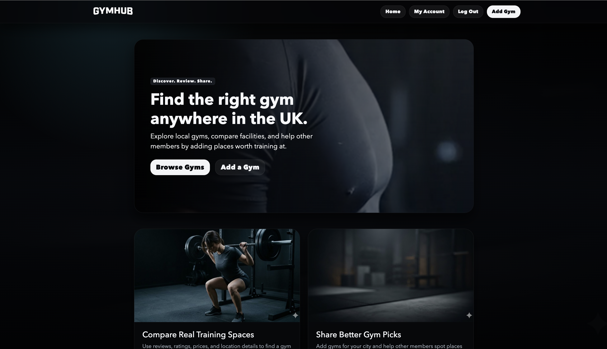

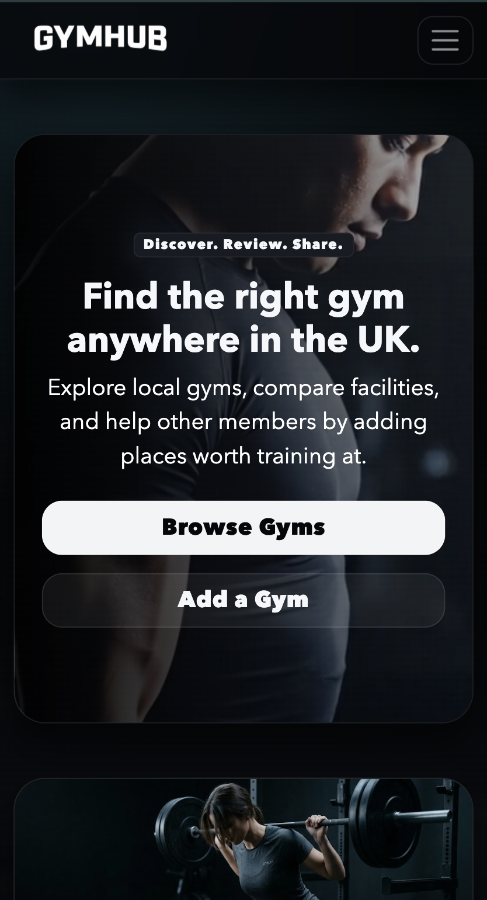

### Gym List Page

The gym list page is where users can browse the approved gyms. It includes search, price filtering, amenity filtering, sorting and reusable gym cards. Each card shows the main gym information, image, rating, amenities and bookmark button.

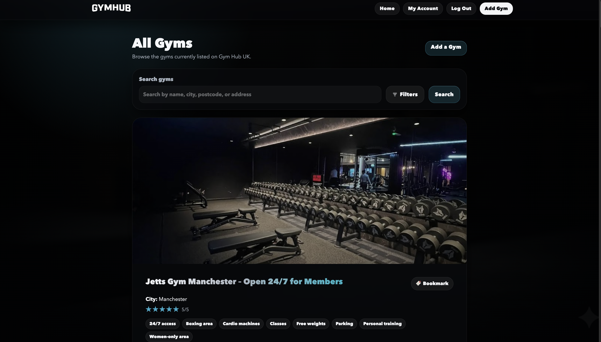

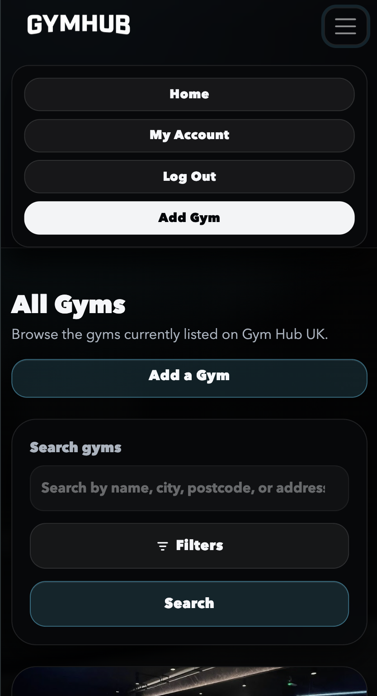

### Gym Detail Page

The gym detail page shows more information about one gym. It includes the gym image, city, address, price range, amenities, average rating, reviews, bookmark option and Google map/open in maps link.

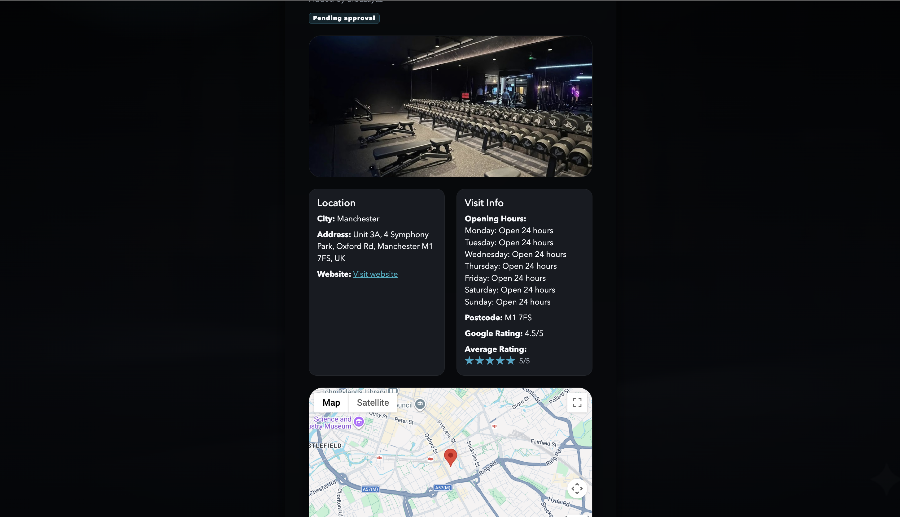

### Add Gym Page

The add gym page lets logged-in users submit a new gym. It includes the Google Places autocomplete field, normal form fields, image upload, price range and amenity selection. Submitted gyms are set to pending until approved.

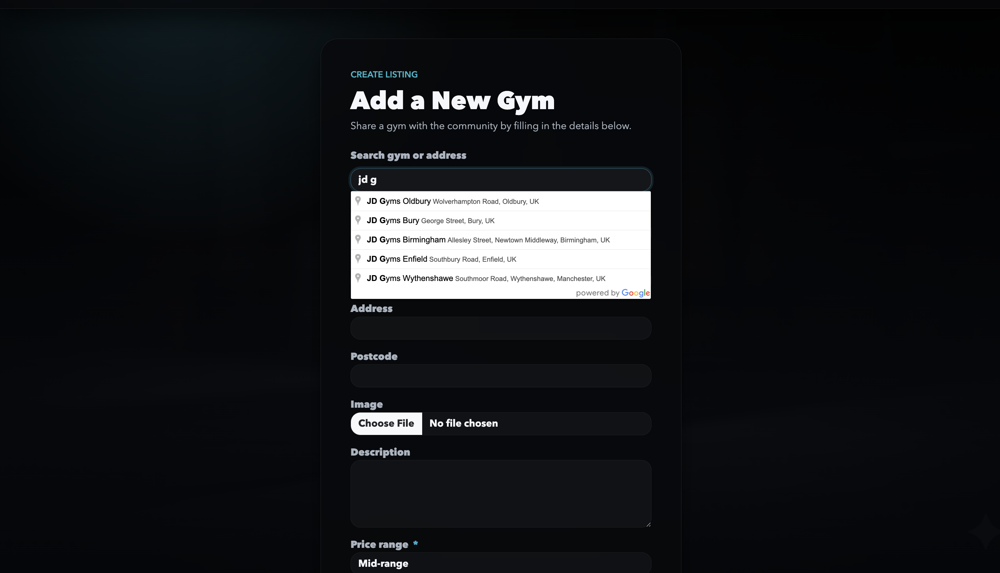

### Account Page

The account page gives logged-in users a simple dashboard. It shows account information and counts for submitted gyms, bookmarks and reviews, with links to the user's saved and submitted gyms.

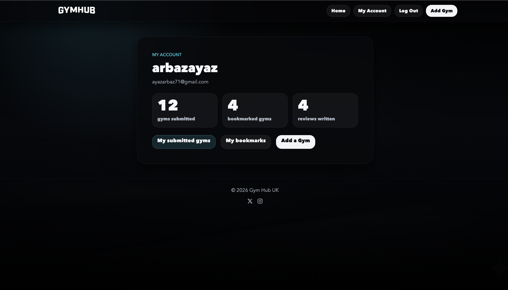

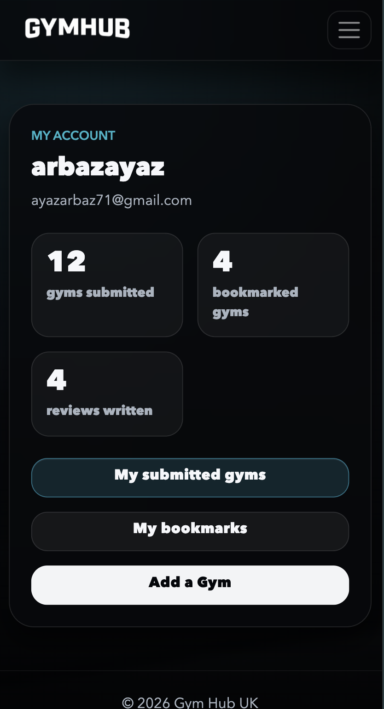

### My Bookmarks Page

The my bookmarks page shows the gyms saved by the current user. It reuses the same gym card style so bookmarked gyms look consistent with the main gym list.

### My Submitted Gyms Page

The my submitted gyms page shows gyms added by the current user. This helps users keep track of submitted gyms and whether they are pending, approved or rejected.

### Edit Review Page

The edit review page lets a user update their own review. The form is pre-filled with the existing rating and comment, and only the review owner can access it.

## Accessibility Features

Accessibility was considered throughout the project so the site is easier to use and understand. I kept the accessibility work simple and relevant rather than adding unnecessary ARIA everywhere.

- **Semantic HTML structure**  
Pages use normal headings, links, buttons, forms and sections where possible, so the structure is easier to follow.

- **Clear page headings**  
Each main page has a clear heading so users can quickly understand what page they are on.

- **Image alt text**  
Important images, such as gym images and the logo, include alt text. Decorative images use empty alt text where they do not add useful meaning.

- **Icon-only links**  
Icon-only links, such as footer social icons, include accessible labels so the purpose of the link is still clear.

- **Clear button text**  
Most buttons use visible text such as Add Gym, Search, Bookmark, Edit and Delete, so users can understand the action without guessing.

- **External social links**  
Footer social links open in a new tab and include `rel="noopener noreferrer"` for safer external linking.

- **Colour contrast**  
The project uses a dark background with light text and cyan highlights. This was chosen to keep the design readable while still matching the gym/fitness style.

- **Responsive layout**  
The layout adapts for smaller screens, and the navbar becomes a hamburger menu on mobile so links do not become crowded.

## Responsive Design

The website was built to work across desktop, tablet and mobile screen sizes. This was important because users may search for gyms while they are out, travelling or using their phone.

Bootstrap was used for some of the layout and responsive behaviour, especially the navbar. On smaller screens, the desktop navigation changes into a hamburger menu so the links do not overcrowd the top of the page.

The gym cards were also designed to adapt to smaller screens. On desktop, the cards have a large visual layout with the image and content spaced out clearly. On mobile, the content stacks more naturally so the text, buttons and bookmark controls remain readable.

Forms were also considered for smaller screens. Inputs, buttons and amenity options use larger spacing so they are easier to tap on mobile. This is especially useful on the add gym page because users may need to fill in several fields.

Custom CSS media queries were used alongside Bootstrap to adjust spacing, image sizing, navbar layout and card behaviour. This helped keep the site consistent without needing to create separate pages for mobile and desktop.

## Technologies Used

- HTML5
- CSS3
- Bootstrap
- Bootstrap Icons
- Python
- Django
- SQLite
- PostgreSQL / Heroku Postgres
- Google Maps JavaScript API
- Google Places API
- Pillow
- WhiteNoise
- Gunicorn
- Git and GitHub
- Heroku

## Testing

### Testing Approach

Testing was mainly carried out manually by using the website in the browser and checking each feature as it was added. This suited the project because a lot of the functionality depends on user interaction, forms, authentication, search filters, maps, bookmarks and admin approval.

Manual testing allowed me to check the project from a user's point of view. For example, I could test whether a user could sign up, log in, submit a gym, leave a review, bookmark a gym and then view that saved gym from their account page.

I also checked the website across different screen sizes and browsers. The main testing was done in Chrome, with additional checks in Safari because this is the browser I commonly use on my Mac. Mobile responsiveness was tested by resizing the browser window and using browser developer tools to check smaller screen widths. This helped me spot issues with the navbar, cards, filter menu and form spacing on mobile.

I also tested the project during deployment because the local version and Heroku version use different environments. Locally the project uses SQLite, while the deployed version uses Heroku Postgres. This meant I had to check migrations, environment variables, Google Maps setup and static files separately on Heroku.

Alongside manual testing, I also checked that the Django project loaded correctly and that the static files worked properly before and after deployment.

### Manual Testing

| Area Tested | What I Tested | How I Tested It | Expected Result | Result |
|-------------|---------------|-----------------|----------------|--------|
| Navigation | Main nav links | I clicked the logo, Home, Add Gym, My Account, Login and Sign Up links. | Each link should take me to the correct page. | Pass |
| Mobile navigation | Hamburger menu | I resized the browser to a mobile width and opened/closed the hamburger menu. | The menu should open clearly and show the nav links without breaking the layout. | Pass |
| Signup | Creating a new account | I opened the signup page, filled in the form and submitted it. | A new account should be created and the user should be logged in/redirected correctly. | Pass |
| Login | Logging into an account | I entered valid login details and submitted the form. | The user should be logged in and taken back to the gym list/home area. | Pass |
| Logout | Logging out | I clicked Log Out from the navbar. | The user should be logged out and the navbar should show Login and Sign Up again. | Pass |
| Navbar state | Logged-in and logged-out navbar | I checked the navbar before and after logging in. | Logged-out users should see Login/Sign Up, while logged-in users should see account options. | Pass |
| Gym list | Approved gyms display | I opened the gym list page as a normal user. | Approved gyms should appear as cards with images and basic information. | Pass |
| Search | Searching gyms | I searched using a gym name, city and address/postcode text. | Matching gyms should be shown and unrelated gyms should be filtered out. | Pass |
| Filters | Price and amenities | I selected price and amenity filters and applied them. | The page should only show gyms that match the selected filters. | Pass |
| Clear filters | Resetting search/filter results | I used the clear filters option after applying filters. | The page should return to the normal gym list. | Pass |
| Sorting | Sorting gyms | I changed the sort option on the gym list page. | The gym list should update based on the selected sort option. | Pass |
| Gym cards | Card layout and bookmark count | I checked cards with and without bookmarks. | Cards should show the gym information clearly and should not show `0 bookmarks`. | Pass |
| Gym detail | Opening a gym | I clicked a gym card/title to open the detail page. | The detail page should show the correct gym information, image, amenities, rating and reviews. | Pass |
| Google map | Map on detail page | I opened a gym with latitude and longitude saved. | The map should load and the Google Maps link should open the location. | Pass |
| Add gym | Submitting a gym | I logged in, filled in the add gym form and submitted it. | The gym should be saved as pending approval. | Pass |
| Google autocomplete | Auto-filling gym details | I searched for a UK gym/address in the autocomplete field and selected a result. | The form should fill fields such as name, address, city, postcode and coordinates where available. | Pass |
| Amenities | Selecting amenities | I selected and unselected amenities on the add gym form. | The selected amenities should be saved with the gym. | Pass |
| Image upload | Uploading a gym image | I uploaded an image while adding a gym. | The image should save and display on the gym card/detail page. | Pass |
| Fallback image | Gym with no image | I viewed a gym that did not have an uploaded or Google image. | A fallback visual should still display so the card does not look broken. | Pass |
| Bookmarks | Bookmark/unbookmark | I clicked the bookmark button on a gym card and detail page. | The gym should save/remove from my bookmarks and the count should update. | Pass |
| My Bookmarks | Saved gyms page | I opened My Bookmarks after saving a gym. | The bookmarked gym should appear on the page. | Pass |
| Reviews | Leaving a review | I logged in and submitted a rating/comment on a gym detail page. | The review should appear on the gym detail page. | Pass |
| Duplicate reviews | Reviewing the same gym twice | I tried to review the same gym again after already reviewing it. | The form should not show again and the user should not be able to submit a duplicate review. | Pass |
| Edit review | Updating a review | I clicked Edit on my own review, changed the rating/comment and submitted it. | The review should update and return to the gym detail page. | Pass |
| Delete review | Removing a review | I clicked Delete on my own review. | The review should be removed and other users should not see edit/delete buttons for it. | Pass |
| Account page | Account stats | I opened My Account while logged in. | The page should show username, email if available, submitted gym count, bookmark count and review count. | Pass |
| My Submitted Gyms | Submitted gyms page | I opened My Submitted Gyms after adding a gym. | My submitted gym should appear with its current status. | Pass |
| Admin moderation | Approving gyms | I logged into the admin area and approved a pending gym. | The gym should become approved and then appear publicly. | Pass |
| Pending visibility | Pending gyms hidden publicly | I checked a pending gym as a normal/logged-out user. | Pending gyms should not appear publicly unless viewed by the submitter or staff. | Pass |
| Browser testing | Chrome and Safari | I checked the main pages in Chrome and also checked the layout in Safari. | Pages should display and function correctly in both browsers. | Pass |
| Mobile layout | Small screen behaviour | I used browser dev tools/resizing to check mobile widths. | Cards, forms, navbar and filters should remain usable on smaller screens. | Pass |
| Heroku deployment | Live site check | I opened the deployed Heroku site and tested the main pages. | The live site should load with static files, database connection and Google features working. | Pass |

### User Story Verification

| User Story | How It Was Met |
|------------|----------------|
| As a user, I want to search for gyms by name, city or location so I can find gyms that are relevant to me. | The gym list page includes a search bar that checks gym details such as name, city, address and description. |
| As a user, I want to filter gyms by price range and amenities so I can find gyms with the facilities I need. | The gym list page includes price and amenity filters so users can narrow down the results. |
| As a user, I want to view a gym detail page so I can see more information before deciding whether to visit. | Each gym card links to a detail page with more information about the gym. |
| As a user, I want to see reviews and ratings so I can get a better idea of other users' experiences. | Gym detail pages show reviews, ratings and the average star rating. |
| As a user, I want to view gym locations on a map so I can understand where the gym is based. | Gym detail pages include Google Maps where location data is available. |
| As a user, I want the website to work on mobile so I can search for gyms easily on different devices. | The layout responds to smaller screens and the navbar becomes a hamburger menu on mobile. |
| As a registered user, I want to create an account so I can use the interactive features of the website. | The signup page allows users to create an account and then use features such as reviews, bookmarks and submissions. |
| As a registered user, I want to log in and log out so my account is protected. | Login and logout links are included in the navbar and change depending on authentication state. |
| As a registered user, I want to bookmark gyms so I can return to them later. | Logged-in users can bookmark and unbookmark gyms from the card and detail pages. |
| As a registered user, I want to view my bookmarked gyms so I can manage the gyms I have saved. | The My Bookmarks page shows gyms saved by the current user. |
| As a registered user, I want to submit a new gym so missing gyms can be added to the platform. | The Add Gym page allows logged-in users to submit new gyms. |
| As a registered user, I want to view my submitted gyms so I can keep track of what I have added. | The My Submitted Gyms page shows gyms submitted by the current user and their status. |
| As a registered user, I want to leave a review so I can share my own experience of a gym. | Logged-in users can leave one review on a gym detail page. |
| As a registered user, I want to edit or delete my own review so I can manage my content. | Users can edit or delete reviews that belong to them. |
| As a staff user, I want to approve submitted gyms so only checked listings appear publicly. | Staff/admin users can approve gyms through the admin moderation workflow. |
| As a staff user, I want to reject invalid gym submissions so the website data stays more accurate. | Staff/admin users can reject submitted gyms so they do not appear publicly. |
| As a staff user, I want to manage amenities and gym details through the admin panel so the site can be maintained properly. | The Django admin allows staff to manage gym listings, statuses and amenities. |

### Validation

HTML validation was carried out using the W3C Markup Validation Service. I checked the main public pages after fixing the aria-label and heading level issues.

| Page | Validator | Result |
|------|-----------|--------|
| Home page | W3C HTML Validator | Pass - no errors or warnings |
| Gym list page | W3C HTML Validator | Pass - no errors or warnings |
| Gym detail page | W3C HTML Validator | Pass - no errors or warnings |
| Custom CSS file | W3C CSS Validator | Pass - no errors found |
| Django project check | Django system check | Pass - no issues found |
| Desktop performance | PageSpeed Insights / Lighthouse | Performance 96, Accessibility 100, Best Practices 100, SEO 100 |

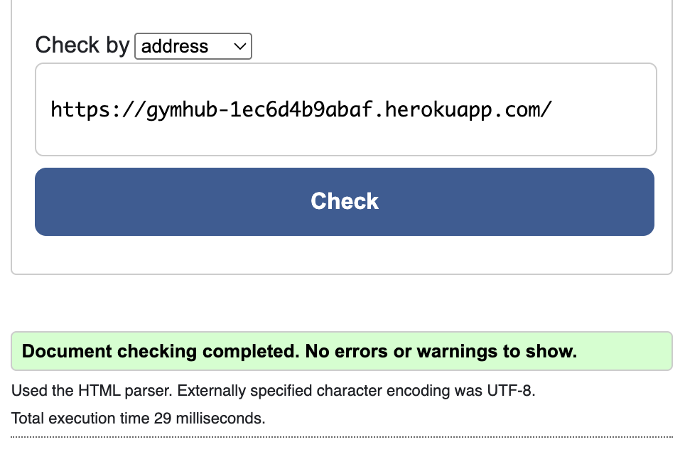

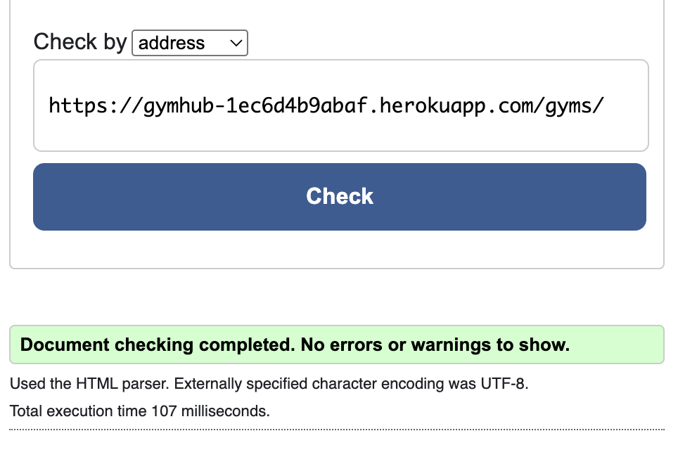

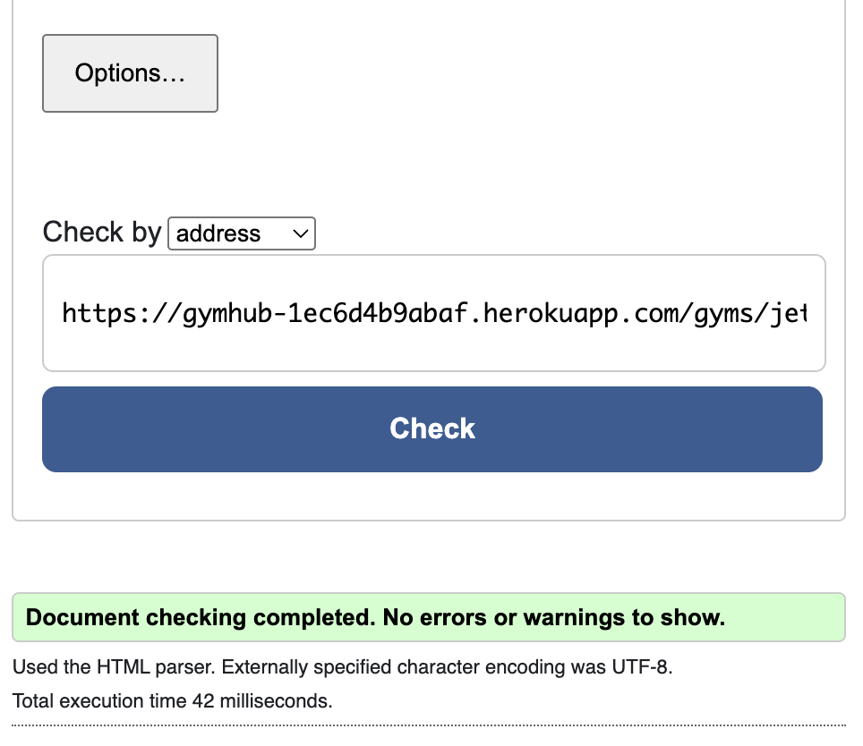

For CSS validation, I checked my custom stylesheet directly instead of validating the whole page with Bootstrap included. When the full page was checked, the validator reported issues from the external Bootstrap CDN file. Checking my own `styles.css` file separately showed no CSS errors.

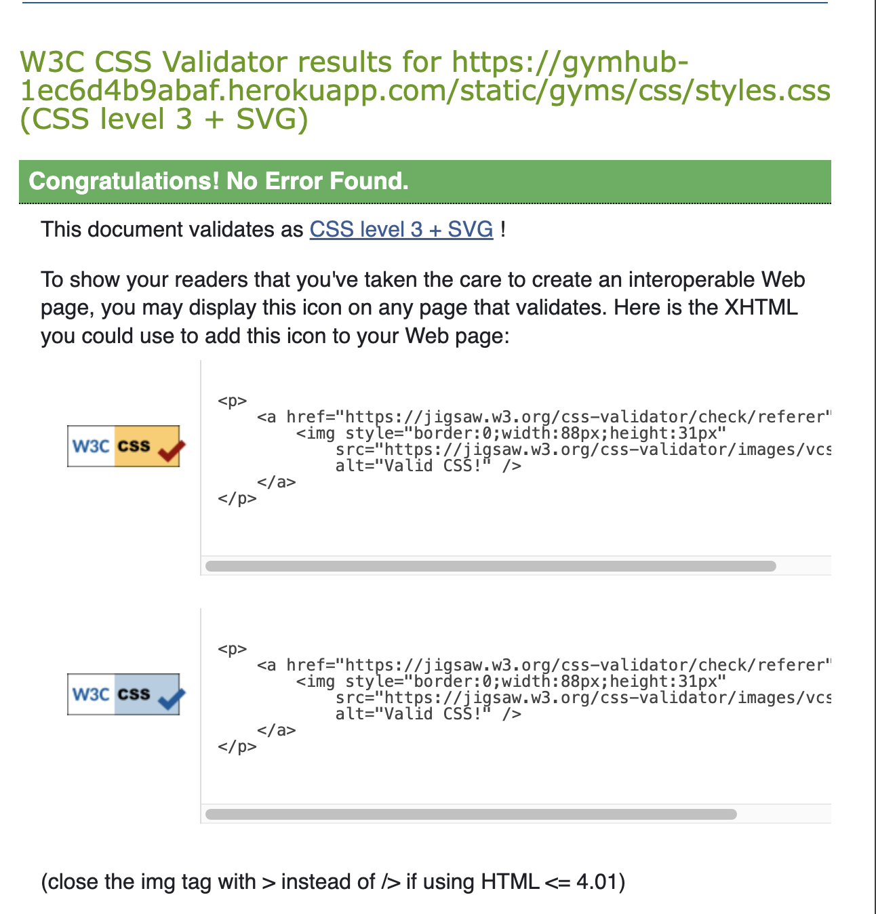

I also ran the Django system check to make sure there were no project configuration issues.

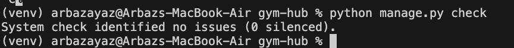

I also checked the deployed site using PageSpeed Insights on desktop. The scores were high across performance, accessibility, best practices and SEO.

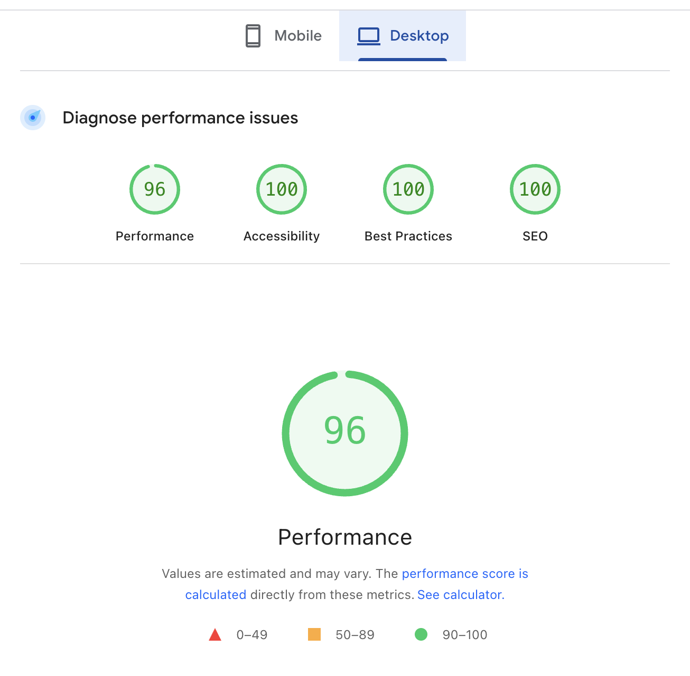

## Bugs and Fixes

During development, I came across a number of bugs while adding features and testing the website manually. Most of these were found by using the site in the browser and checking that the pages, forms, buttons and deployment worked as expected.

| Feature Area | Bug / Issue | Cause | Fix Applied | How It Was Tested | Status |
|--------------|-------------|-------|-------------|-------------------|--------|
| Django URLs | Add gym page showed an `AttributeError`. | The URL was looking for a view name that was not there. | Changed the URL/view name so it pointed to the correct add gym view. | I opened the add gym page again and the Django error was gone. | Fixed |
| Bootstrap layout | Page content looked too close to the side of the screen. | The content was not inside a proper container. | Added a container around the main page content so the spacing was more consistent. | I tested this by viewing a few pages and resizing the browser. | Fixed |
| Gym cards | Gyms first displayed like a plain list instead of cards. | The list template was only showing basic text and links. | Changed the gym list into card layouts with image, title, city, rating, amenities and bookmark controls. | I then checked the gym list page to make sure each card displayed properly. | Fixed |
| Gym images | Some gym images were not showing. | The image paths were not pointing to the correct static folder. | Moved the images into the Django static folder and updated the image paths. | I refreshed the home and gym list pages and the images appeared. | Fixed |
| Google Places | Google showed “This page can't load Google Maps correctly”. | The wrong Places API version was enabled in Google Cloud. | Enabled the legacy Places API because that was the one working with the current setup. | I tested the add gym page again and the suggestions started appearing. | Fixed |
| Google Places | The suggestions appeared, but clicking one did not select it. | The dropdown was being blocked by the page/card styling. | Added `.pac-container` CSS with a higher `z-index` and `pointer-events: auto`. | I selected a suggestion and checked that the form fields filled in. | Fixed |
| Google Places | Autocomplete showed places outside the UK. | The autocomplete was not restricted to a country. | Added the UK country restriction to the autocomplete options. | I searched for gym names and checked the suggestions were UK based. | Fixed |
| Google Places | Google worked locally but had issues on the deployed Heroku site. | The Heroku domain was not allowed in the Google API key restrictions. | Added the Heroku domain to the allowed website restrictions in Google Cloud. | I verified this on the deployed site by checking autocomplete and maps. | Fixed |
| Add gym form | Amenities showed on the form but were not easy to select. | The checkbox styling made the options look like buttons but selection was not clear enough. | Updated the amenity checkbox styling so selected options were clearer. | I selected and unselected amenities to make sure the state changed clearly. | Fixed |
| Search filters | The filter menu did not fully open. | The menu was being cut off by layout positioning. | Adjusted the filter menu spacing/positioning so the full menu could show. | I opened the filter menu and checked that all options were visible. | Fixed |
| Search filters | There was no obvious apply filter button. | The filter menu depended too much on the main search button. | Added a clearer apply button inside the filter area. | I chose filters, applied them and checked the gym results changed. | Fixed |
| Search filters | Search and filter controls looked uneven. | The input and buttons had different heights and alignment. | Updated the CSS so the search row lined up better. | I checked it visually on desktop and then narrowed the browser width. | Fixed |
| Reviews | A user could leave more than one review on the same gym. | There was no strong duplicate review prevention at first. | Added a database constraint and hid the form once the user had reviewed that gym. | I left a review and then checked that the form no longer appeared for that gym. | Fixed |
| Reviews | Edit and delete buttons looked uneven. | The buttons did not line up properly in the review card. | Adjusted the review card button layout. | I checked my own review card and compared the Edit and Delete buttons. | Fixed |
| Authentication | It looked like the wrong user was signed in because the navbar showed the email. | The navbar was displaying the user's email instead of username. | Changed it so the navbar shows the username. | I logged in again and checked the navbar text. | Fixed |
| Navigation | Navbar buttons looked too big compared with the logo. | Button padding and logo sizing were not balanced. | Made the nav buttons smaller and adjusted the logo without increasing the navbar height. | I checked the navbar on desktop and mobile widths. | Fixed |
| Navigation | Mobile navigation needed to become a hamburger menu. | The desktop nav did not fit well on mobile. | Added Bootstrap hamburger navigation for smaller screens. | I resized the browser and checked that the menu opened and closed. | Fixed |
| Bookmarks | Gym cards showed `0 bookmarks`. | The bookmark count was showing even when there were no bookmarks. | Changed the template so the count only shows when there is at least one bookmark. | I checked gyms with no bookmarks and gyms with bookmarks. | Fixed |
| Moderation | New user-submitted gyms were visible before approval. | Submitted gyms were not being filtered by status yet. | Added pending/approved/rejected status and filtered public pages to only show approved gyms. | I checked it as the submitter, as a logged-out user and as staff. | Fixed |
| Heroku deployment | Heroku failed while collecting static files. | `STATIC_ROOT` was missing from settings. | Added `STATIC_ROOT`, WhiteNoise and static file settings. | I redeployed and checked that the build moved past the static files error. | Fixed |
| Heroku deployment | Heroku warned that no Python version was set. | There was no `.python-version` file. | Added `.python-version` with `3.14`. | I checked the file was in the project root before pushing again. | Fixed |
| Heroku deployment | Heroku needed a command to run the app. | There was no `Procfile` or Gunicorn dependency. | Added Gunicorn and a `Procfile` with `web: gunicorn config.wsgi`. | I checked the deployment files and pushed the setup. | Fixed |
| Heroku Postgres | The app was only set up for local SQLite. | The database settings did not read Heroku's `DATABASE_URL`. | Added `dj-database-url` and `psycopg2-binary`, with SQLite still used locally as a fallback. | I checked that the project still loaded after changing the database settings. | Fixed |
| Heroku Postgres | The deployed database was empty at first. | Local SQLite data does not automatically move into Heroku Postgres. | Treated Heroku Postgres as a separate production database and planned to add/approve data there separately. | I checked the deployed site and realised the data needed to be created on Heroku. | Fixed |
| Heroku Postgres | Heroku showed missing database table errors such as `gyms_amenity`. | The migrations had not been run on the Heroku database yet. | Ran the Django migrations on Heroku so the production database tables were created. | I reopened the deployed site after migrations and checked the database error was gone. | Fixed |
| Heroku config | Google autocomplete was disabled on Heroku. | `GOOGLE_MAPS_API_KEY` was not set as a Heroku config variable. | Added the Google Maps API key to Heroku config vars. | I checked the add gym page on Heroku and confirmed autocomplete could load. | Fixed |
| Image storage | AWS S3 was considered but was not working reliably for the submission. | Extra storage setup would add more risk and complexity close to submission. | Decided not to rely on S3 and kept the project using the current image/fallback setup. | I checked that pages still displayed uploaded or fallback gym images correctly. | Resolved |

## Version Control

Version control was used throughout the development of this project to manage changes, track progress and keep the project organised. Git and GitHub were used together, with VS Code as the main development environment.

I followed a simple workflow by working on a feature or fixing a bug, testing it, and then committing the change with a clear message. This made it easier to keep track of what had been added and also helped when debugging, because I could look back at previous commits to understand when a change was made.

Commits were made regularly throughout the project and were usually based around individual features or fixes. For example, commits were used for adding reviews, bookmarks, authentication, Google Maps integration, admin moderation, deployment fixes and README updates.

GitHub was also important for deployment because the Heroku app was connected to the GitHub repository. This meant the deployed project could be updated from the main branch after changes were pushed.

Overall, version control helped keep the development process more organised and made it easier to build the project in stages rather than trying to add everything at once.

## Deployment

This project was deployed using Heroku because it is a Django application and needs a backend server and database. GitHub was still used first for version control and to store the project repository.

### GitHub Setup

The project was first set up through GitHub and then linked to my local project through Terminal.

The following steps were taken:

1. I created the project repository on GitHub.
2. I used the GitHub repository options to set up/copy the repository link.
3. I opened Terminal on my Mac.
4. I navigated to the folder where the project was stored.
5. I linked the local project folder to the GitHub repository using the remote repository URL.
6. I added and committed changes throughout development.
7. I pushed the commits to the main GitHub repository.

The GitHub repository was then used as the source for deployment to Heroku.

### Heroku Deployment

The live site was deployed using Heroku:

https://gymhub-1ec6d4b9abaf.herokuapp.com

The following steps were taken:

1. I created a new Heroku app.
2. I connected the Heroku app to the GitHub repository.
3. I added the required Heroku config vars for the project.
4. I added Heroku Postgres so the deployed project had a production database.
5. I made sure the project had the deployment files needed for Heroku, including `Procfile`, `.python-version`, `requirements.txt` and static file settings.
6. I deployed the project from the main branch.
7. I ran the database migrations on Heroku so the production database tables were created.
8. I tested the live site after deployment to check the pages, styling, database and Google Maps features worked correctly.

During deployment, I also had to fix issues with static files, Python version, Heroku Postgres and Google API key settings. These are listed in the Bugs and Fixes section.

### Environment Variables

The project uses environment variables so private settings are not placed directly in the public GitHub repository.

The main environment variables used were:

```text
SECRET_KEY
DEBUG
GOOGLE_MAPS_API_KEY
DATABASE_URL
ALLOWED_HOSTS
```

`DATABASE_URL` is provided by Heroku Postgres. The Google Maps key was also added to Heroku config vars so autocomplete and maps could work on the deployed site.

## Future Improvements

- **Improve bookmark behaviour**  
At the moment, bookmarking uses a normal page refresh. In the future, I would improve this with JavaScript so bookmarks update instantly without moving the user back to the top of the page.

- **Add stronger image storage**  
Image uploads currently work for the project, but a proper cloud storage setup such as AWS S3 or Cloudinary would be better for a real deployed version.

- **Add more advanced filters**  
The current filters cover search, price and amenities. In the future, I could add distance-based filtering, rating filters or opening-hours filters.

- **Improve review moderation**  
Users can manage their own reviews, but a future version could include reporting reviews or admin review moderation.

- **Improve map features**  
The current map shows individual gym locations. A future improvement could show multiple gyms on one map or allow users to search nearby gyms.

## References

### Code and Documentation

- Django documentation  
https://docs.djangoproject.com/

- Django authentication documentation  
https://docs.djangoproject.com/en/stable/topics/auth/

- Bootstrap documentation  
https://getbootstrap.com/

Bootstrap was used for the responsive navbar, hamburger menu, containers, spacing utilities, buttons, forms and basic layout helpers.

- Bootstrap Icons  
https://icons.getbootstrap.com/

Bootstrap Icons were used for the footer social media icons.

- Google Maps JavaScript API documentation  
https://developers.google.com/maps/documentation/javascript

- Google Places API documentation  
https://developers.google.com/maps/documentation/places/web-service

- Heroku Django deployment documentation  
https://devcenter.heroku.com/articles/deploying-python

- WhiteNoise documentation  
https://whitenoise.readthedocs.io/

- Pillow documentation  
https://pillow.readthedocs.io/

- W3C HTML Validator  
https://validator.w3.org/

- W3C CSS Validator  
https://jigsaw.w3.org/css-validator/

- Google PageSpeed Insights  
https://pagespeed.web.dev/

### Media

- Some visual assets were adapted from my own personal fitness-related project.

- Some gym-style images were generated using Google Gemini and then used as supporting visuals for the Gym Hub UK interface.

- Google Places data was used for gym address autocomplete, map location data and available Google business information.

### Design Inspiration

- The visual style was influenced by a personal fitness-related project I had also been working on.

- The design uses a dark fitness-style layout, cyan accent colours, large image-led cards and reusable CSS styling.
